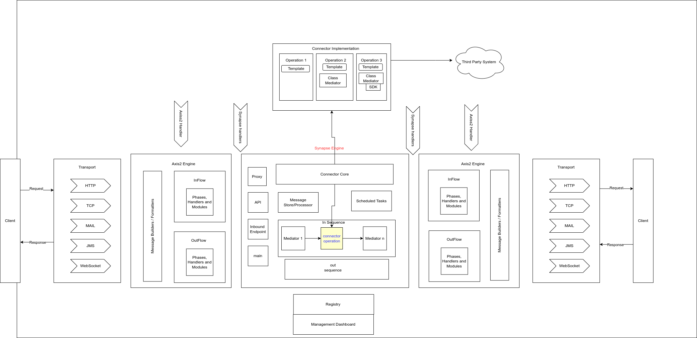
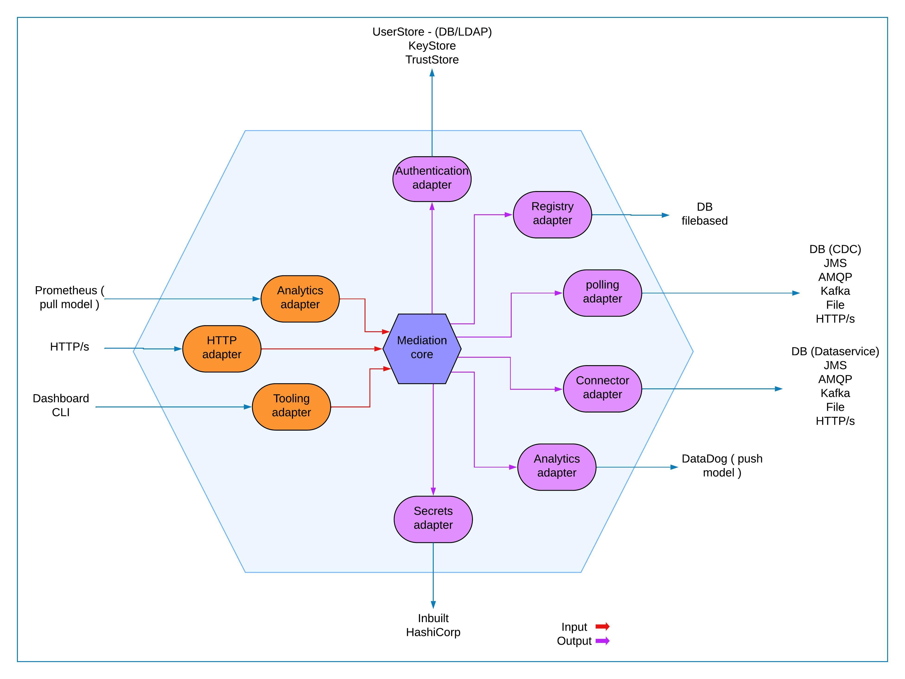

# Architecture Overview

The Synapse Java project follows a modular architecture based on the **Ports and Adapters** (Hexagonal) design pattern. This ensures that the core business logic is decoupled from external systems, making the system highly testable and extensible.

## Key Architectural Components

1. **Core Domain**: Contains the core business logic and models (e.g., `Inbound`, [Sequence](http://_vscodecontentref_/1), [API](http://_vscodecontentref_/2)).
2. **Ports**: Define interfaces for inbound and outbound communication (e.g., `InboundEndpoint`, `InboundMessageMediator`).
3. **Adapters**: Implement the ports to interact with specific protocols or systems (e.g., `FileInboundEndpoint`, `HttpInboundEndpoint`).
4. **Deployers**: Handle the deployment of artifacts such as sequences, APIs, and inbound endpoints.
5. **Mediation Engine**: The central component that mediates messages between inbound endpoints and sequences.

## Component Structure

Existing Architecture

Proposed Architecture   

## Key Benefits

- **Separation of Concerns**: Each component has a well-defined responsibility.
- **Testability**: Core logic can be tested without external dependencies.
- **Extensibility**: New inbound protocols or mediators can be added easily.
- **Maintainability**: Changes to one component don't affect others.