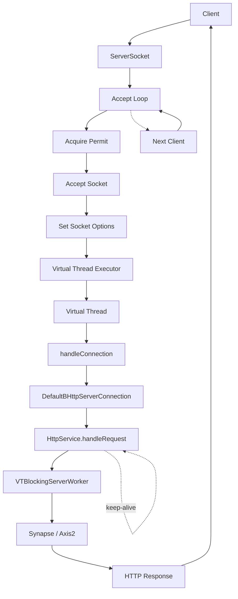
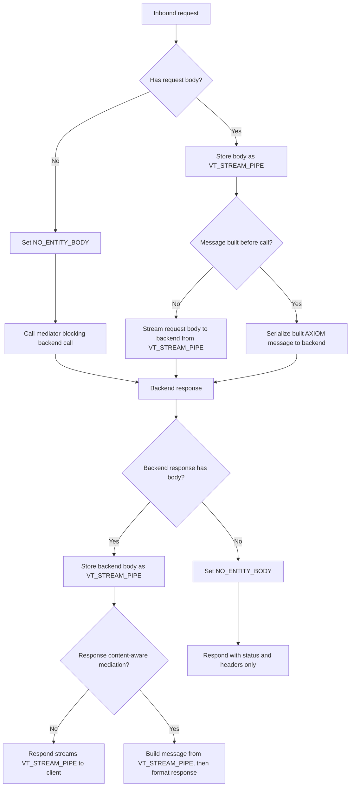

## VT Streaming Cases

| Case | Request | Response |
|---|---|---|
| `GET` / `DELETE` without body | Not streamed | Streamed |
| `GET` / `DELETE` with body | Not streamed | Streamed |
| `POST` / `PUT` / `PATCH` with body, not built | Streamed | Streamed |
| `POST` / `PUT` / `PATCH` with body, already built | Not streamed | Streamed |
| `POST` / `PUT` / `PATCH` without body | Not streamed | Streamed |

## Streaming Rules

| Flag / property | Meaning |
|---|---|
| `VT_STREAM_PIPE` | Raw body stream is available for pass-through. On request it is the client body; on response it is the backend body. |
| `MESSAGE_BUILDER_INVOKED` | A content-aware mediator already built the body. Request streaming stops and the built message is serialized instead. |
| `NO_ENTITY_BODY` | Current message has no body entity. Response path should send status and headers only unless a new response pipe is later set. |
| `VT_BACKEND_CALL` | Marks outbound call as VT backend call so `VTHttpSender` uses the VT streaming response setup. |

## End-To-End Streaming

End-to-end streaming is preserved when:

1. The inbound request body remains in `VT_STREAM_PIPE`.
2. No content-aware mediator builds the request before the blocking call.
3. The backend response is stored as `VT_STREAM_PIPE`.
4. No response-side mediator, such as Call mediator target enrichment, calls `buildMessage()` before `<respond/>`.
