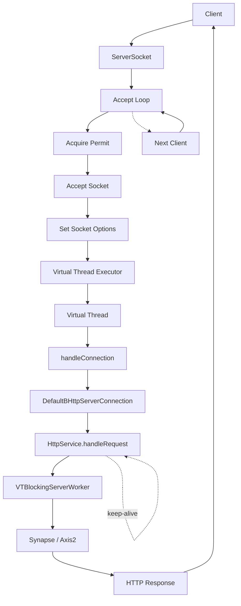

## VT Streaming Cases

| Case | Request | Response |
|---|---|---|
| `GET` / `DELETE` without body | Not streamed | Streamed |
| `GET` / `DELETE` with body | Not streamed | Streamed |
| `POST` / `PUT` / `PATCH` with body| Streamed | Streamed |
| `POST` / `PUT` / `PATCH` without body | Not streamed | Streamed |

